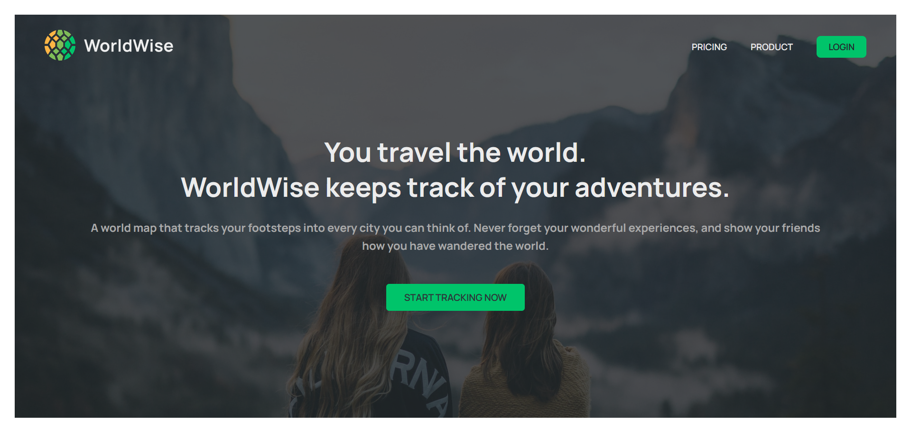
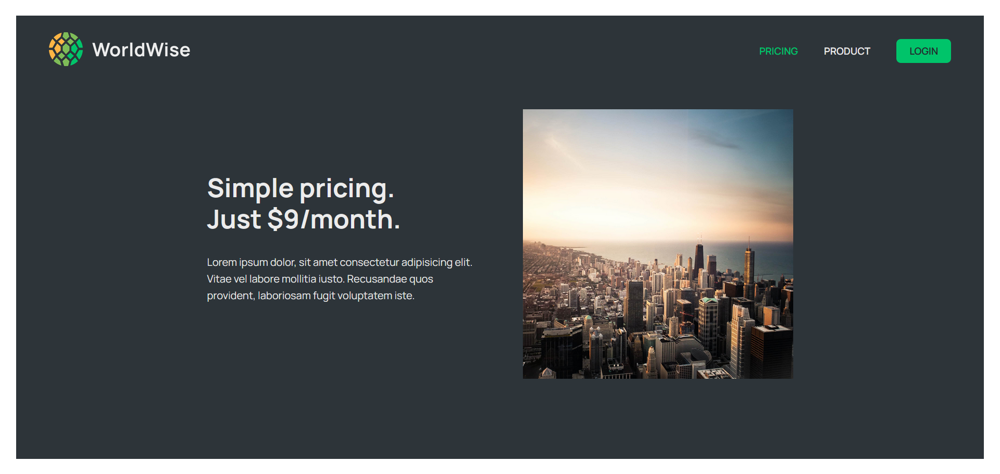
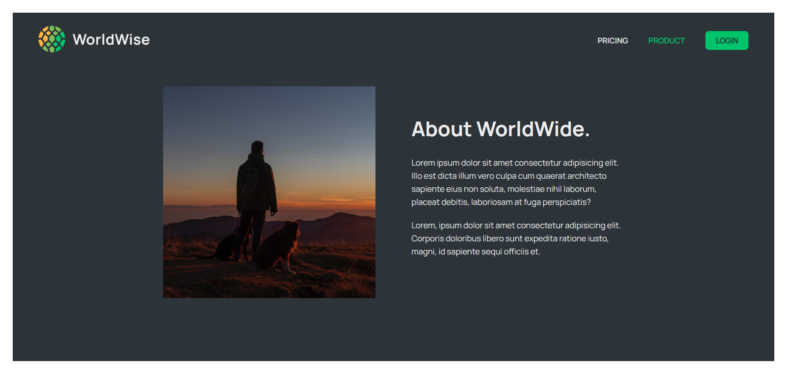
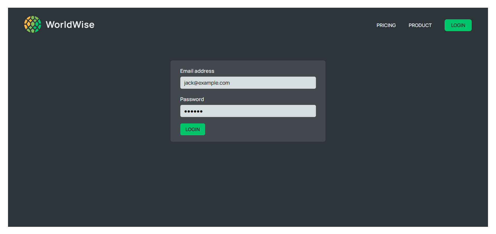
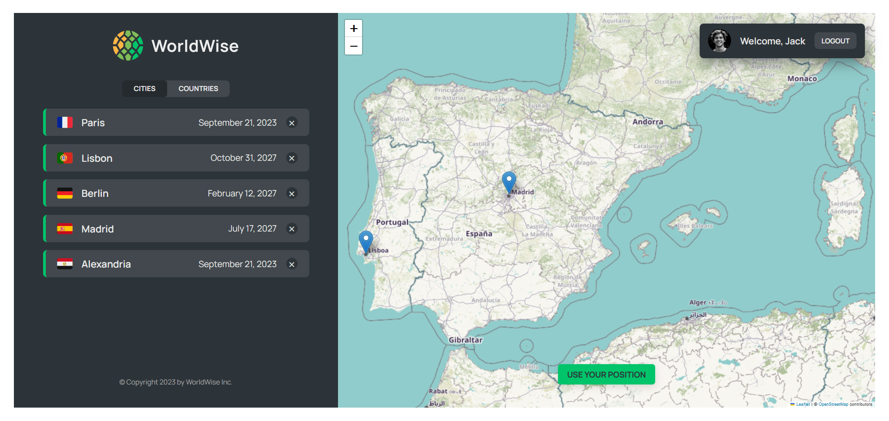
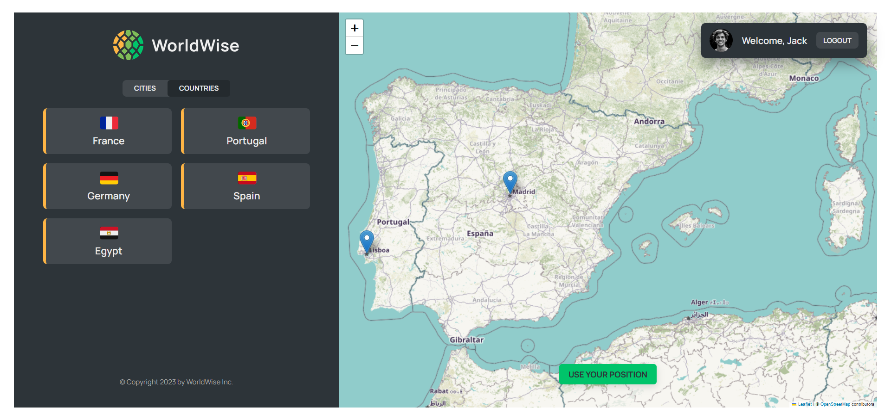
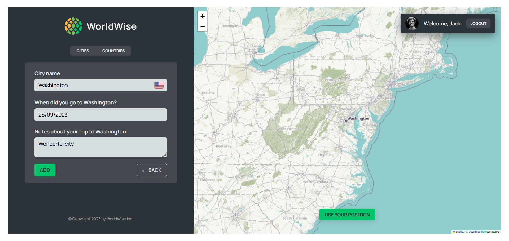

## Table of Contents

- [Table of Contents](#table-of-contents)
- [👋Introduction](#introduction)
- [🌟Features](#features)
- [🚀 Live Demo](#-live-demo)
- [📸 Screenshots](#-screenshots)
  - [🏠Home Page](#home-page)
  - [💲Pricing Page](#pricing-page)
  - [📖About Page](#about-page)
  - [🔑Login Page](#login-page)
  - [📱Main App Page](#main-app-page)
  - [🌐Countries Section](#countries-section)
  - [➕Add New City Section](#add-new-city-section)
- [🛠️Technologies Used](#️technologies-used)
- [🏁Getting Started](#getting-started)
- [⬇️Installation](#️installation)
- [🔧Usage](#usage)
- [📄License](#license)

## 👋Introduction

WorldWise is an app that enables you save the places where you have been and the places you want to go. It is a simple app that allows you to create a list of places you have been and places you want to go. You can also add notes to each place. It is a great way to keep track of your travels and plan your next trip.

## 🌟Features

- Create a list of places you have been and places you want to go.
- Add notes to each place.
- View a map of all the places you have been and places you want to go.
- smoothly select the country you want to visit and add it to your list.
- remove cities from your list.

## 🚀 Live Demo

[🌍WorldWise](https://world-wise-ts.netlify.app/)

##  📸 Screenshots

### 🏠Home Page



### 💲Pricing Page



### 📖About Page



### 🔑Login Page



### 📱Main App Page



### 🌐Countries Section



### ➕Add New City Section



## 🛠️Technologies Used

The WorldWise project utilizes the following technologies:

-  &nbsp; &nbsp;[React](https://reactjs.org/)

-  &nbsp; &nbsp;[React Router](https://reactrouter.com/)

-  &nbsp; &nbsp; [Firebase](https://firebase.google.com/)

-  &nbsp; &nbsp;[TypeScript](https://www.typescriptlang.org/)

- [React leaflet](https://react-leaflet.js.org/)

- CSS Modules

## 🏁Getting Started

To set up the WorldWise project locally, follow the instructions below.

## ⬇️Installation

1. Clone the repository:

   ```bash
   git clone https://github.com/khaled-farahat/WorldWise.git
   cd WorldWise
   ```

1. Install the dependencies:

   ```bash
   npm install
   ```

## 🔧Usage

1. Run the development server:

   ```bash
   npm run dev
   ```

1. Open your browser and navigate to [http://localhost:5173/](http://localhost:5173/) to access WorldWise application.

1. Login with already created account

1. Start adding your cities to the list

## 📄License

The WorldWise project is open-source and is licensed under the [MIT License](LICENSE) .
